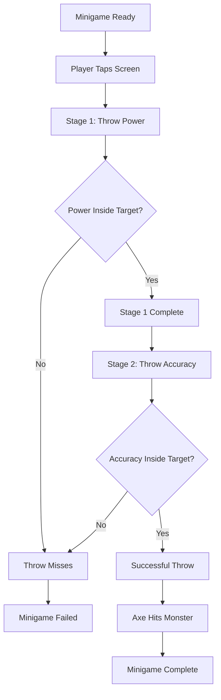
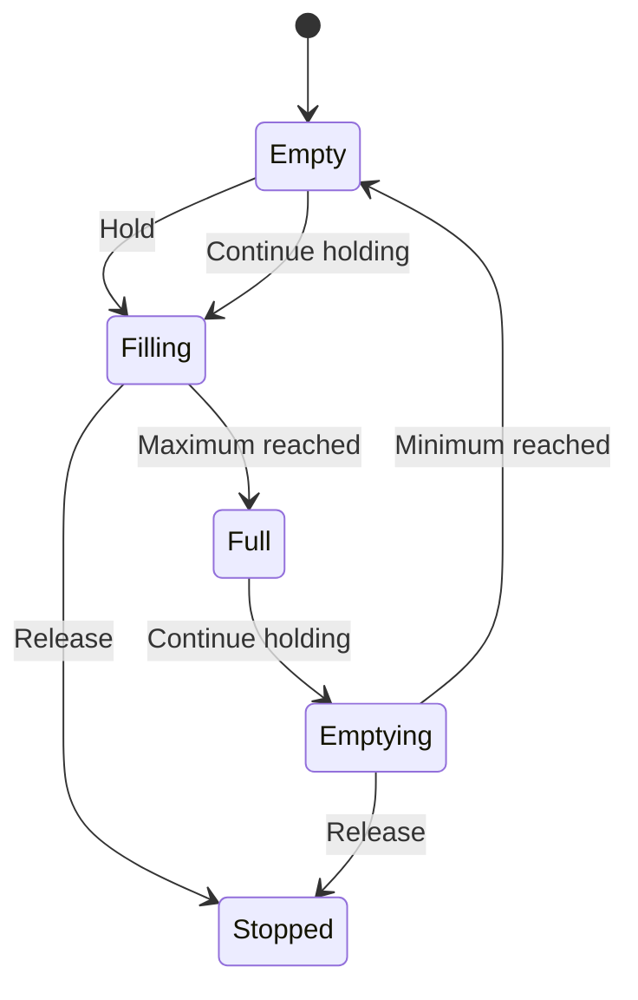
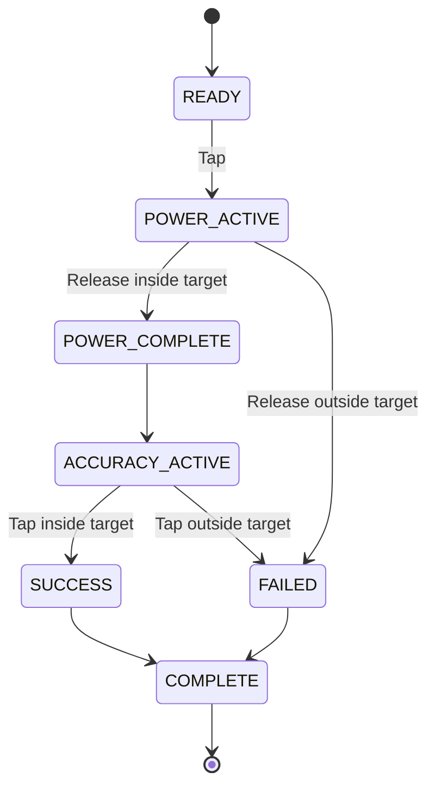

# Monster Throw Minigame — Feature Specification

> **Portfolio Edition**
>
> This document is a sanitized and restructured portfolio version of a
> feature specification originally created by me as part of commercial
> game development.
>
> Product and company-identifying information has been removed.
> The original feature behavior and requirements have been preserved
> while the document structure and wording have been revised for clarity
> and portfolio presentation.

---

## Document Information

| Property | Value |
|---|---|
| Document type | Feature Functional Specification |
| Domain | Game Development |
| Feature type | Timing / Accuracy Minigame |
| Language | English |
| Target audience | Developers, QA, Game Designers, UI/2D Artists |
| Original context | Commercial game development |
| Portfolio purpose | Technical Writing portfolio |

---

## Table of Contents

- [1. Overview](#1-overview)
- [2. Feature Goal](#2-feature-goal)
- [3. Gameplay Overview](#3-gameplay-overview)
- [4. User Flow](#4-user-flow)
- [5. Stage 1 — Throw Power](#5-stage-1--throw-power)
- [6. Stage 2 — Throw Accuracy](#6-stage-2--throw-accuracy)
- [7. Success and Failure Conditions](#7-success-and-failure-conditions)
- [8. Minigame States](#8-minigame-states)
- [9. Functional Requirements](#9-functional-requirements)
- [10. UI Requirements](#10-ui-requirements)
- [11. Scene and Art Requirements](#11-scene-and-art-requirements)
- [12. Acceptance Criteria](#12-acceptance-criteria)
- [13. Open Questions](#13-open-questions)
- [14. Portfolio Notes](#14-portfolio-notes)

---

# 1. Overview

The Monster Throw Minigame is a two-stage timing and accuracy challenge.

The player controls a hero attempting to stop an approaching monster by
throwing an axe.

To perform a successful attack, the player must complete two consecutive
input challenges:

1. **Throw Power** — stop a vertical slider inside its target area.
2. **Throw Accuracy** — stop a horizontally moving indicator inside its
   target area.

Both stages must be completed successfully.

If the player fails either stage, the axe misses the monster and the
minigame ends in failure.

---

# 2. Feature Goal

The player's goal is to hit the monster with the thrown axe.

The player controls two parameters of the throw:

| Parameter | Interaction |
|---|---|
| Throw Power | Long press and release |
| Throw Accuracy | Timed tap |

The minigame is completed successfully only if both parameters fall
inside their corresponding target areas.

---

# 3. Gameplay Overview

At the beginning of the minigame:

- the hero stands on the left side of the scene;
- the monster stands on the right side;
- the hero is aiming an axe at the monster;
- a start notification is displayed.

The player taps the screen to begin.

The minigame then proceeds through two stages.



---

# 4. User Flow

1. The minigame scene is displayed.
2. The hero is shown aiming the axe at the monster.
3. A start notification is displayed.
4. The player taps the screen.
5. The camera moves slightly closer to the hero.
6. Stage 1 begins.
7. The vertical Power Slider appears.
8. The player holds the screen to control the slider.
9. The player releases the screen to stop the slider.
10. The system evaluates the slider position.
11. If Stage 1 is successful, a completion message is displayed.
12. Stage 2 begins.
13. The horizontal Accuracy Slider appears.
14. The player taps the screen to stop the moving indicator.
15. The system evaluates the indicator position.
16. If both stages are successful, the hero throws the axe and hits the
    monster.
17. If either stage fails, the hero misses and the minigame ends in
    failure.

---

# 5. Stage 1 — Throw Power

## 5.1 Description

Stage 1 determines the power of the axe throw.

A vertical slider appears to the right of the hero.

The slider contains a target area representing the valid power range.

---

## 5.2 Player Input

The player controls the slider using a **long press**.

- Holding the screen fills the slider.
- Releasing the screen stops the slider.

---

## 5.3 Slider Behavior

The slider starts empty.

While the player holds the screen:

1. the slider fills from bottom to top;
2. if the slider reaches its maximum value and the player continues
   holding the screen, it begins moving back toward the starting
   position;
3. the movement continues cyclically while the input is held.

The player releases the screen to stop the slider.



---

## 5.4 Stage Evaluation

After the player releases the screen, the system compares the final
slider position with the target area.

### Success

The stage is successful if:

`Slider Position ∈ Target Area`

When Stage 1 is completed successfully:

1. the slider stops;
2. a completion message is displayed;
3. the minigame proceeds to Stage 2.

### Failure

The stage fails if:

`Slider Position ∉ Target Area`

If Stage 1 fails:

- the throw is considered unsuccessful;
- the hero misses the monster;
- Stage 2 is not completed;
- the minigame ends in failure.

---

# 6. Stage 2 — Throw Accuracy

## 6.1 Description

Stage 2 determines the accuracy of the axe throw.

A horizontal slider is displayed.

The slider contains a target area representing the valid accuracy range.

---

## 6.2 Slider Behavior

Unlike the Power Slider, the Accuracy Slider moves automatically.

The indicator:

1. moves across the slider;
2. reaches the end of its movement range;
3. returns and continues moving cyclically.

The player does not control the movement directly.

---

## 6.3 Player Input

The player taps the screen to stop the moving indicator.

The system then compares the stopped position with the target area.

---

## 6.4 Stage Evaluation

### Success

The stage is successful if:

`Indicator Position ∈ Target Area`

If Stage 2 is successful:

1. the minigame is completed;
2. the hero throws the axe;
3. the axe hits the monster.

### Failure

The stage fails if:

`Indicator Position ∉ Target Area`

If Stage 2 fails:

- the hero misses the monster;
- the minigame ends in failure.

---

# 7. Success and Failure Conditions

## 7.1 Overall Success

The minigame is successful only when:

```text
Stage 1 = SUCCESS
AND
Stage 2 = SUCCESS
```

Result:

**Axe hits the monster.**

---

## 7.2 Overall Failure

The minigame fails when:

```text
Stage 1 = FAILURE
OR
Stage 2 = FAILURE
```

Result:

**Axe misses the monster.**

---

## 7.3 Result Matrix

| Stage 1 | Stage 2 | Result |
|---|---|---|
| Success | Success | Axe hits the monster |
| Success | Failure | Axe misses the monster |
| Failure | Not started | Axe misses the monster |

---

# 8. Minigame States

The feature can be represented using the following states.

| State | Description |
|---|---|
| `READY` | Scene is displayed and the minigame is waiting for the player's initial input |
| `POWER_ACTIVE` | Player controls the vertical Power Slider |
| `POWER_COMPLETE` | Stage 1 has been completed successfully |
| `ACCURACY_ACTIVE` | Horizontal Accuracy Slider is moving automatically |
| `SUCCESS` | Both stages have been completed successfully |
| `FAILED` | At least one stage has been failed |
| `COMPLETE` | Final minigame result has been processed |

### State Flow



---

# 9. Functional Requirements

| ID | Requirement |
|---|---|
| FR-01 | The minigame must display the hero and monster before gameplay begins. |
| FR-02 | The minigame must display a start notification before Stage 1 begins. |
| FR-03 | The player must be able to start the minigame by tapping the screen. |
| FR-04 | The camera must move slightly closer to the hero when Stage 1 begins. |
| FR-05 | Stage 1 must display a vertical slider with a visible target area. |
| FR-06 | Holding the screen must move the Power Slider from bottom to top. |
| FR-07 | The Power Slider must reverse its movement after reaching the end of its range while the input remains active. |
| FR-08 | The Power Slider must continue moving cyclically while the player continues holding the screen. |
| FR-09 | Releasing the screen must stop the Power Slider. |
| FR-10 | Stage 1 must succeed when the slider stops inside the target area. |
| FR-11 | A successful Stage 1 must display a completion message before Stage 2. |
| FR-12 | Stage 2 must display a horizontal slider with a visible target area. |
| FR-13 | The Stage 2 indicator must move automatically. |
| FR-14 | The Stage 2 indicator must move cyclically across its movement range. |
| FR-15 | Tapping the screen must stop the Stage 2 indicator. |
| FR-16 | Stage 2 must succeed when the indicator stops inside the target area. |
| FR-17 | Successfully completing both stages must result in the hero throwing the axe and hitting the monster. |
| FR-18 | Stopping either slider outside its target area must result in minigame failure. |
| FR-19 | A failed minigame must result in the hero missing the monster. |

---

# 10. UI Requirements

## 10.1 Start Notification

Before the minigame begins:

- a notification must indicate that the minigame is ready;
- the player must have an opportunity to prepare;
- tapping the screen starts Stage 1.

---

## 10.2 Power Slider

The Stage 1 slider must:

- use a vertical orientation;
- appear to the right of the hero;
- contain a visible target area;
- visually represent the current slider position.

---

## 10.3 Accuracy Slider

The Stage 2 slider must:

- use a horizontal orientation;
- contain a visible target area;
- display the automatically moving indicator.

---

## 10.4 Target Area

The target area must be visually distinguishable from the rest of the
slider.

The same visual concept should be used for the target areas in both
stages.

---

# 11. Scene and Art Requirements

## 11.1 Camera and Composition

The scene uses a **2D side view**.

Composition:

```text
[ HERO ]                     [ MONSTER ]
              VILLAGE
             BACKGROUND
```

The hero is positioned on the left side of the screen.

The monster is positioned on the right side.

A village is visible in the background.

The setting is a medieval fantasy world.

---

## 11.2 Hero

The hero is a green orc.

### Visual Characteristics

- light leather armor;
- bright color palette;
- friendly rather than threatening appearance.

The character may contain punk-inspired visual elements, such as:

- distinctive hairstyles;
- beards;
- small facial piercings.

The hero faces the monster and aims the axe toward it.

---

## 11.3 Axe

The hero uses a two-bladed axe.

The axe consists of:

- two blades;
- a wooden handle.

The weapon should contain visible scratches and signs of wear to
communicate that it has been used in combat.

---

## 11.4 Monster

The monster is approximately half the size of the orc hero.

The creature has:

- a rounded body;
- four short legs;
- multiple clustered eyes;
- a large mouth;
- crooked teeth;
- a prominent lower jaw.

The monster uses darker tones than the hero and should have a
threatening appearance.

---

# 12. Acceptance Criteria

> The acceptance criteria below are a portfolio restructuring of the
> behavior described in the original specification. The original
> production document did not use the Given/When/Then format.

---

## AC-01 — Start Minigame

**Given** the minigame is in the `READY` state,

**When** the player taps the screen,

**Then** Stage 1 starts and the Power Slider is displayed.

---

## AC-02 — Successful Power Input

**Given** Stage 1 is active,

**When** the player releases the screen while the Power Slider is inside
the target area,

**Then** Stage 1 is completed successfully and the minigame proceeds to
Stage 2.

---

## AC-03 — Failed Power Input

**Given** Stage 1 is active,

**When** the player releases the screen while the Power Slider is
outside the target area,

**Then** the minigame ends in failure and the hero misses the monster.

---

## AC-04 — Power Slider Cycle

**Given** Stage 1 is active,

**When** the player continues holding the screen after the Power Slider
reaches the end of its range,

**Then** the slider begins moving toward its starting position and
continues cycling while the input remains active.

---

## AC-05 — Successful Accuracy Input

**Given** Stage 2 is active,

**When** the player taps while the moving indicator is inside the target
area,

**Then** the minigame succeeds and the hero's axe hits the monster.

---

## AC-06 — Failed Accuracy Input

**Given** Stage 2 is active,

**When** the player taps while the moving indicator is outside the
target area,

**Then** the minigame ends in failure and the hero misses the monster.

---

# 13. Open Questions

The original specification does not define exact values or behavior for
the following items.

These should be clarified before implementation rather than assumed.

## Gameplay Parameters

- What is the exact size of the Stage 1 target area?
- What is the exact size of the Stage 2 target area?
- What is the Power Slider movement speed?
- What is the Accuracy Slider movement speed?
- Are slider speeds constant or configurable?
- Does difficulty affect the target-area size or slider speed?

## Transitions

- How long is the transition between Stage 1 and Stage 2?
- Does Stage 2 start automatically after the Stage 1 completion message,
  or does it require additional player input?
- How long is the completion message displayed?

## Camera

- What is the exact camera movement distance?
- What is the camera movement duration?
- Does the camera return to its initial position after the minigame?

## Result Behavior

- How long does the success animation last?
- How long does the failure animation last?
- Can the player retry the minigame after failure?
- What happens after the minigame is completed?
- Is a reward granted for successful completion?

## Audio

- Are sound effects required for slider movement?
- Is audio feedback required when the indicator enters the target area?
- What sound effects are required for success and failure?

---

# 14. Portfolio Notes

## What This Sample Demonstrates

This sample demonstrates experience with:

- feature specifications;
- functional requirements;
- gameplay behavior documentation;
- user flows;
- system states;
- input behavior;
- success and failure scenarios;
- UI requirements;
- art requirements;
- acceptance criteria;
- requirement identifiers;
- Mermaid diagrams;
- technical documentation in English.

---

## Original Documentation

The original commercial document contained:

- a general description of the minigame;
- a technical task for the developer;
- a technical task for the designer;
- gameplay behavior;
- success and failure conditions;
- visual requirements;
- visual references.

---

## Portfolio Adaptation

For this portfolio edition:

- company-identifying information was removed;
- product-identifying information was removed;
- the original gameplay logic was preserved;
- developer and designer requirements were reorganized into functional
  sections;
- requirements were assigned `FR-*` identifiers;
- the existing gameplay flow was represented using Mermaid diagrams;
- existing behavior was formalized as acceptance criteria;
- unspecified implementation details were documented as Open Questions
  instead of being invented.

The `FR-*` identifiers, state representation, Mermaid diagrams, and
Given/When/Then acceptance criteria are part of the portfolio
restructuring and were not presented in this format in the original
production document.