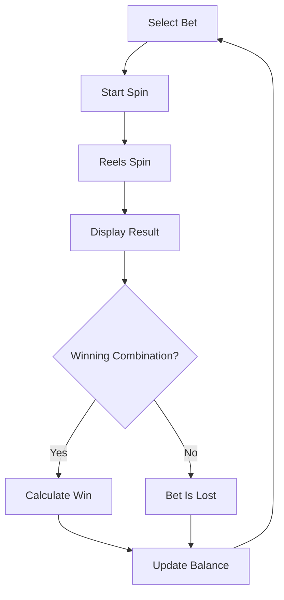
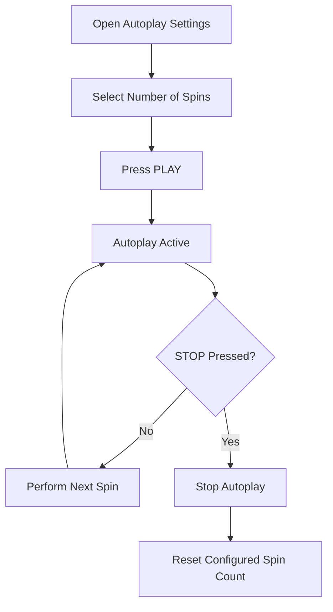
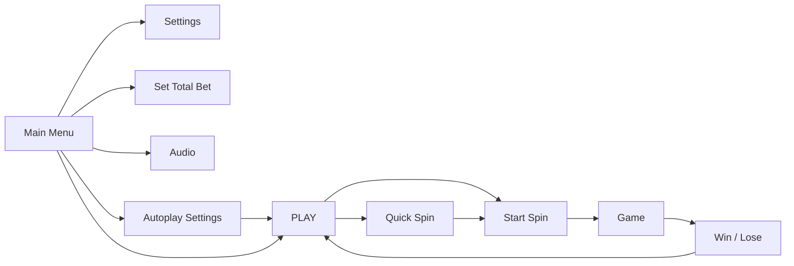

# Slot Game — Functional Specification

> **Portfolio Edition**
>
> This document is a sanitized and restructured portfolio version of a
> functional specification originally created by me as part of commercial
> game development.
>
> Company and product-identifying information has been removed.
> The original requirements have been reorganized and edited for clarity,
> consistency, and portfolio presentation.

---

## Document Information

| Property | Value |
|---|---|
| Document type | Functional Specification |
| Domain | iGaming / Online Slots |
| Language | English |
| Target audience | Developers, QA, Game Designers, UI/UX Designers |
| Original context | Commercial game development |
| Portfolio purpose | Technical Writing portfolio |

---

## Table of Contents

- [1. Purpose](#1-purpose)
- [2. Product Overview](#2-product-overview)
- [3. Core Game Configuration](#3-core-game-configuration)
- [4. Core Game Flow](#4-core-game-flow)
- [5. Win Evaluation](#5-win-evaluation)
- [6. Betting](#6-betting)
- [7. Maximum Win](#7-maximum-win)
- [8. Special Symbols and Mechanics](#8-special-symbols-and-mechanics)
  - [8.1 WILD](#81-wild)
  - [8.2 COLLECT and Multiplier Symbols](#82-collect-and-multiplier-symbols)
- [9. BONUS Mechanic](#9-bonus-mechanic)
- [10. Free Spins](#10-free-spins)
- [11. Gold Spins](#11-gold-spins)
- [12. Bonus Purchase](#12-bonus-purchase)
- [13. Autoplay](#13-autoplay)
- [14. User Interface](#14-user-interface)
- [15. Settings Menu](#15-settings-menu)
- [16. Player Information Display](#16-player-information-display)
- [17. Visual Requirements](#17-visual-requirements)
- [18. Functional Requirements](#18-functional-requirements)
- [19. Open Questions](#19-open-questions)

---

# 1. Purpose

This document describes the functional behavior, game rules, bonus
mechanics, user interface, and visual requirements of an online slot game.

The specification covers:

- core gameplay rules;
- betting behavior;
- win evaluation;
- special symbols;
- bonus modes;
- autoplay behavior;
- user interface controls;
- game information displayed to the player;
- visual and animation requirements.

The purpose of this document is to provide development, QA, game design,
and UI/UX teams with a structured description of the expected system
behavior.

---

# 2. Product Overview

The product is an online slot game with six reels and 4096 possible
winning combinations.

The player selects a bet and starts a spin. After the reels stop, the
system evaluates the resulting symbols and determines whether a winning
combination has been formed.

The game contains:

- a base game;
- special symbols;
- multiplier mechanics;
- Free Spins;
- Gold Spins;
- bonus purchase;
- autoplay;
- configurable bet values;
- game history;
- sound settings.

---

# 3. Core Game Configuration

| Parameter | Value |
|---|---:|
| Reels | 6 |
| Winning combinations | 4096 |
| Minimum matching symbols | 3 |
| Starting balance | 100 FUN |
| Minimum bet | 0.20 FUN |
| Maximum bet | 20 FUN |
| RTP | 95.002% |
| Volatility | High |
| Maximum win | x5000 |
| Maximum autoplay spins | 1000 |

---

# 4. Core Game Flow

The base game follows the sequence below.



### Flow Description

1. The player selects a bet.
2. The player starts a spin.
3. The reels spin and stop.
4. The resulting symbols are displayed.
5. The system checks the result for winning combinations.
6. If a winning combination exists, the system calculates the win.
7. The win is credited to the player's balance.
8. If no winning combination exists, the bet is lost.
9. The player can start another spin.

---

# 5. Win Evaluation

A winning combination requires at least **three identical symbols**.

Winning combinations are evaluated according to the following rules:

- evaluation starts from the leftmost reel;
- matching symbols must continue across consecutive reels;
- a combination is interrupted if the required symbol is absent from
  the next reel;
- at least three matching symbols are required;
- special symbols follow their individual substitution and collection
  rules.

The game supports **4096 possible winning combinations**.

---

# 6. Betting

## 6.1 Bet Selection

The player selects a bet before starting a spin.

The supported bet range is:

**0.20–20 FUN**

The bet can be changed:

- using the `+` and `–` controls in the main interface;
- from the **Total Bet** section of the Settings menu.

The selected bet cannot be changed while a spin or autoplay sequence is
in progress.

---

## 6.2 Available Bet Values

| | | | |
|---:|---:|---:|---:|
| 0.20 | 0.40 | 0.60 | 0.80 |
| 1.00 | 2.00 | 3.00 | 4.00 |
| 5.00 | 6.00 | 7.00 | 8.00 |
| 9.00 | 10.00 | 15.00 | 20.00 |

---

# 7. Maximum Win

The maximum win is limited to:

**x5000**

If the maximum win is reached during Free Spins:

1. Free Spins mode ends immediately.
2. The calculated win is credited to the player.
3. Any remaining Free Spins are discarded.

---

# 8. Special Symbols and Mechanics

## 8.1 WILD

### Description

WILD substitutes for regular symbols to complete a winning combination.

### Exceptions

WILD does **not** substitute for:

- COIN;
- MINOR;
- MAJOR;
- GRAND;
- COLLECT;
- BONUS.

### Availability

| Game Mode | Available Reels |
|---|---|
| Base Game | 2–6 |
| Free Spins | 2–4 |

---

## 8.2 COLLECT and Multiplier Symbols

Multiplier symbols can appear on the reels.

Available multiplier symbols:

| Symbol | Value |
|---|---:|
| COIN | x1 / x2 / x3 / x4 / x5 / x10 / x20 / x25 |
| MINOR | x50 |
| MAJOR | x200 |
| GRAND | x1000 |

### COLLECT

COLLECT can appear on reels **1 and 6**.

The COLLECT symbol is required for multiplier values to be collected.

When COLLECT participates in the corresponding combination, the
available multiplier coefficients are collected and applied according
to the game rules.

---

# 9. BONUS Mechanic

BONUS symbols can appear on all reels.

A combination containing **3–6 BONUS symbols** activates bonus
selection.

The available bonus modes are:

- Free Spins;
- Gold Spins.

## 9.1 BONUS Rewards

| BONUS Symbols | FUN Reward | Bonus Mode Reward |
|---:|---:|---|
| 3 | 5.00 | 2 Gold Spins or 8 Free Spins |
| 4 | 10.00 | 3 Gold Spins or 12 Free Spins |
| 5 | 15.00 | 5 Gold Spins or 20 Free Spins |
| 6 | 25.00 | 7 Gold Spins or 30 Free Spins |

---

# 10. Free Spins

Free Spins increase the number of higher-value symbols available on the
reels.

## 10.1 WILD Multipliers

During Free Spins, each WILD participating in a winning combination
becomes a WILD multiplier.

Possible multiplier values:

- x2;
- x3;
- x5.

The multiplier value is selected randomly.

If multiple WILD multipliers participate in the same winning
combination:

1. their multiplier values are added together;
2. the resulting multiplier is applied to the win.

### Example

If two WILD symbols with `x2` and `x3` participate in the same winning
combination:

`Total multiplier = x2 + x3 = x5`

The resulting `x5` multiplier is then applied to the corresponding win.

---

## 10.2 Additional Free Spins

BONUS symbols collected during Free Spins award additional spins.

| BONUS Symbols | Additional Free Spins |
|---:|---:|
| 2 | 5 |
| 3 | 8 |
| 4 | 12 |
| 5 | 20 |
| 6 | 30 |

---

# 11. Gold Spins

During Gold Spins, only collectible symbols appear on the reels:

- COLLECT;
- COIN;
- MINOR;
- MAJOR;
- GRAND.

At least one COLLECT symbol must appear during each Gold Spin.

Therefore, each Gold Spin guarantees a win according to the collection
rules.

---

# 12. Bonus Purchase

The player can purchase access to a bonus mode using FUN currency.

A purchased bonus guarantees a combination containing at least
**four BONUS symbols**.

The resulting bonus selection provides access to:

- Gold Spins;
- Free Spins.

---

## 12.1 Bonus Price

The bonus price is calculated using the following formula:

```text
A = B × 75
```

where:

| Variable | Description |
|---|---|
| A | Bonus price |
| B | Bet per spin |

### Example

For a bet of `2 FUN`:

```text
A = 2 × 75
A = 150 FUN
```

The bonus price is therefore **150 FUN**.

---

## 12.2 Insufficient Balance

**Given** the player's balance is lower than the calculated bonus price,

**When** the player attempts to purchase the bonus,

**Then** the purchase is rejected and an insufficient-funds message is
displayed.

---

# 13. Autoplay

Autoplay allows the player to run a predefined number of spins
automatically.

Maximum number of automatic spins:

**1000**

## 13.1 Autoplay Behavior

While autoplay is active:

- spins start automatically;
- the current bet cannot be changed;
- Quick Spin remains available;
- the player can stop autoplay manually.

If autoplay is interrupted, the number of spins must be configured
again before starting another autoplay sequence.

---

## 13.2 Autoplay Flow



---

# 14. User Interface

## 14.1 Main Controls

### PLAY / STOP

#### PLAY

Starts a spin using the currently selected bet.

After the spin starts, the bet cannot be changed.

#### STOP

STOP replaces PLAY during autoplay.

Pressing STOP interrupts the autoplay sequence.

---

### QUICK SPIN

Quick Spin changes the reel presentation behavior.

When enabled:

- individual reel-stop animations are skipped;
- the resulting symbol combination is displayed immediately.

The player can enable or disable Quick Spin.

---

### SET AUTOPLAY

Opens the autoplay settings.

The player selects the required number of automatic spins and starts
autoplay using PLAY.

---

### AUDIO

Enables or disables game audio.

---

### HOME

Closes the game.

This control is available only in the desktop version.

---

### SETTINGS

Opens the Settings menu.

---

### SET TOTAL BET

Opens the Total Bet section of the Settings menu.

---

## 14.2 Main UI Flow



---

# 15. Settings Menu

The Settings menu contains five sections:

1. Total Bet
2. Game Info
3. Sound Options
4. Autoplay Options
5. History

The player can close the Settings menu using the **CLOSE** button.

---

## 15.1 Total Bet

The Total Bet section allows the player to configure the bet amount.

The section provides **16 predefined bet values**.

The PLAY control is also available from this section.

---

## 15.2 Game Info

The Game Info section contains:

- information about regular symbols;
- information about special symbols;
- winning combinations;
- game modes;
- maximum win;
- RTP;
- basic game rules;
- interface instructions;
- settings instructions.

---

## 15.3 Sound Options

The player can configure:

- music volume;
- sound-effect volume.

Both parameters use sliders with values from:

`0–100`

The **MUTE** option sets all sound parameters to `0`.

---

## 15.4 Autoplay Options

The player can configure the number of automatic spins.

Supported range:

`0–1000`

The value can be selected using:

- a slider;
- predefined buttons.

### Predefined Values

| 25 | 50 | 100 |
|---:|---:|---:|
| 150 | 200 | MAX |

---

## 15.5 History

History stores information about spins performed during the current
game session.

### Data Stored for Every Spin

| Data | Stored |
|---|:---:|
| Resulting symbols | Yes |
| Game mode | Yes |
| Date and time | Yes |
| Player balance | Yes |
| Bet amount | Yes |

Supported game-mode values include:

- Base Game;
- Gold Spins;
- Free Spins.

### Additional Data for Winning Spins

- win amount;
- winning combinations.

---

# 16. Player Information Display

The main interface displays the player's current game information.

| Element | Description |
|---|---|
| CREDIT | Current amount of game currency |
| WIN | Win received from the current spin |
| BET | Bet selected for the next spin |

The `+` button increases the selected bet.

The `–` button decreases the selected bet.

---

# 17. Visual Requirements

## 17.1 General Style

The game uses cartoon-style 2D graphics.

The visual theme is a bright confectionery environment with a festive
atmosphere.

Primary colors include:

- pink;
- blue;
- purple.

Background elements use softer pastel colors.

---

## 17.2 Animation

### Reel Animation

Reel movement should:

- be smooth;
- stop gradually.

### Winning Combination Feedback

Winning symbols use visual feedback including:

- flashing;
- scaling;
- visual effects.

---

## 17.3 Main Screen

The main screen contains:

- reels;
- information about major wins;
- navigation controls;
- game mascot.

Navigation controls must not obstruct the reels.

### Control Priority

**PLAY / STOP**

- largest navigation control;
- highest visual prominence.

**AUDIO**

- smallest navigation control;
- should not interfere with gameplay visibility.

Other controls use a consistent medium size.

---

# 18. Functional Requirements

This section summarizes the key functional requirements described
throughout the specification.

| ID | Requirement |
|---|---|
| FR-01 | The player must be able to select a bet before starting a spin. |
| FR-02 | The supported bet range must be 0.20–20 FUN. |
| FR-03 | The game must evaluate winning combinations from left to right across consecutive reels. |
| FR-04 | A winning combination must contain at least three matching symbols. |
| FR-05 | The player must not be able to change the bet while a spin is active. |
| FR-06 | The maximum win must not exceed x5000. |
| FR-07 | Reaching x5000 during Free Spins must immediately end Free Spins mode. |
| FR-08 | Any remaining Free Spins must be discarded after the maximum win is reached. |
| FR-09 | WILD must not substitute for COIN, MINOR, MAJOR, GRAND, COLLECT, or BONUS. |
| FR-10 | WILD must appear only on reels 2–6 in the Base Game. |
| FR-11 | WILD must appear only on reels 2–4 during Free Spins. |
| FR-12 | A combination of 3–6 BONUS symbols must activate bonus selection. |
| FR-13 | Each Gold Spin must contain at least one COLLECT symbol. |
| FR-14 | Autoplay must support up to 1000 automatic spins. |
| FR-15 | The player must be able to stop autoplay manually. |
| FR-16 | The bet must not be changed while autoplay is active. |
| FR-17 | Quick Spin must remain available during autoplay. |
| FR-18 | The bonus purchase price must equal the current bet multiplied by 75. |
| FR-19 | A bonus purchase must be rejected if the player's balance is insufficient. |
| FR-20 | History must store spin information for the current game session. |
| FR-21 | Sound volume controls must support values from 0 to 100. |
| FR-22 | MUTE must set all sound parameters to 0. |

---

# 19. Open Questions

The original specification does not fully define the following behavior.

These items should be clarified with the relevant product or development
stakeholder before implementation.

### Gameplay

- What happens if the player's balance is lower than the selected bet?
- What happens if the player's balance becomes insufficient during
  autoplay?
- How is the maximum win handled outside Free Spins?
- What is the exact calculation order when multiple special mechanics
  affect the same win?
- What rounding rules apply to monetary calculations?

### UI

- Can Quick Spin be enabled or disabled while a spin is already active?
- What exact messages are displayed for invalid operations?
- What is the expected behavior while a game operation is being
  processed?

### History

- Is game history cleared when the current session ends?
- Is history persisted between sessions?
- Is there a maximum number of history entries?

### Technical Behavior

- What happens if a connection error occurs during a spin?
- What happens if a connection error occurs during a bonus purchase?
- How should an interrupted transaction be recovered?
- Which operations require server-side confirmation?

---

# Portfolio Notes

## What This Sample Demonstrates

This portfolio sample demonstrates experience with:

- functional specifications;
- technical documentation in English;
- functional requirements;
- business rules;
- formulas and constraints;
- UI behavior documentation;
- system flows;
- bonus and state-based mechanics;
- structured tables;
- requirement identifiers;
- Mermaid diagrams;
- documentation restructuring.

## Portfolio Adaptation

The original document was created as part of commercial game
development.

For this portfolio edition:

- company-identifying information was removed;
- product-identifying information was removed;
- the original requirements were preserved;
- the document structure was redesigned;
- terminology and English wording were edited for consistency;
- existing requirements were summarized using `FR-*` identifiers;
- existing flows were recreated as Mermaid diagrams;
- undefined behavior was documented as Open Questions rather than
  invented.

No intentionally undefined product behavior was added as a confirmed
requirement.